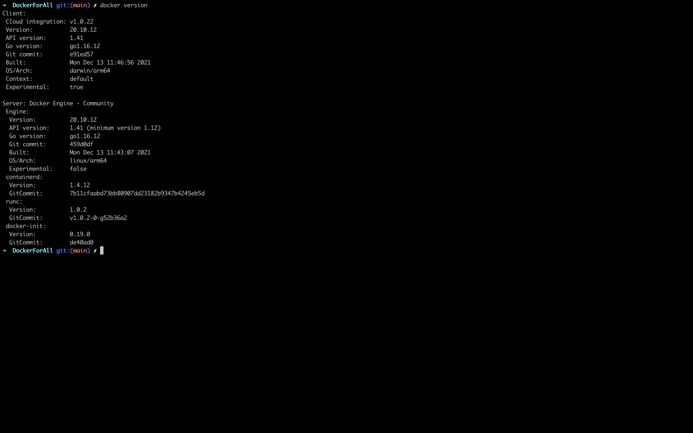

# Containers and Images

### What is a Process?
`A process in Computer Science is Simply a Program running on you computer.`

So whenever you open 'Task Manager' and check processes to kill the one with Excessive Memory, you are basically killing a program that is using Extra Resources.

### What is a Container then?
```
A container is a collection of one or more processes, organized under a single name and
identifying ID that is isolated from the other processes running within a computing environment.
That computing environment can be a physical computer or a virtual machine.
```

A container is simply a process which has all the required dependencies for the the software and the software itself packed in.

So basically in easy terms it is a transportable software which is ready to be run quickly as it has all of the packages it needs to run.

## Lets check our installation:

1. Run `docker version` on your terminal to check the version of docker you have installed.




1. Kindly ensure both Docker Client and Server are running.

1. To enable the Server just open the Docker GUI application on your device otherwise you wont be able to access containers or run them.

## Dockerfile
Simply put Docker is used to replicate your development environment to any device with ease.

Dockerfile is a text file which contains all the necessary information of the Development Environment 

Basically we use this file to store requirements we would need on the new environment to run our Software.
Dockerfile is used to rebuild the environment again on new machines.

## Docker Image
Dockerfiles are used to build Docker Images which are like blueprints to create containers.

It is the Images that matter to us.
The Dockerfile has info which is used to pack relevant packages in an Image which is compact and can be reused

Later this image can be used to unpack back into the container which we will use further.


What we need in the end is a Container which we run an work in .
So an easy way to understand is a Image further a Instruction Manual on how to rebuild a environment in form of a container.

One image can create multiple containers.

## Container 
```
In the world of object oriented programming, you often deal with classes.
You can think of a Docker image as a class, where as a Docker container is an instance of that class.
```

### Resources
- [Dockerfile vs Image vs Container](https://nickjanetakis.com/blog/differences-between-a-dockerfile-docker-image-and-docker-container)

- [Docker Images](https://blog.packagecloud.io/what-is-a-docker-image/)

- [Image vs Container](https://www.theserverside.com/blog/Coffee-Talk-Java-News-Stories-and-Opinions/compare-Docker-image-vs-container-difference-compare)
