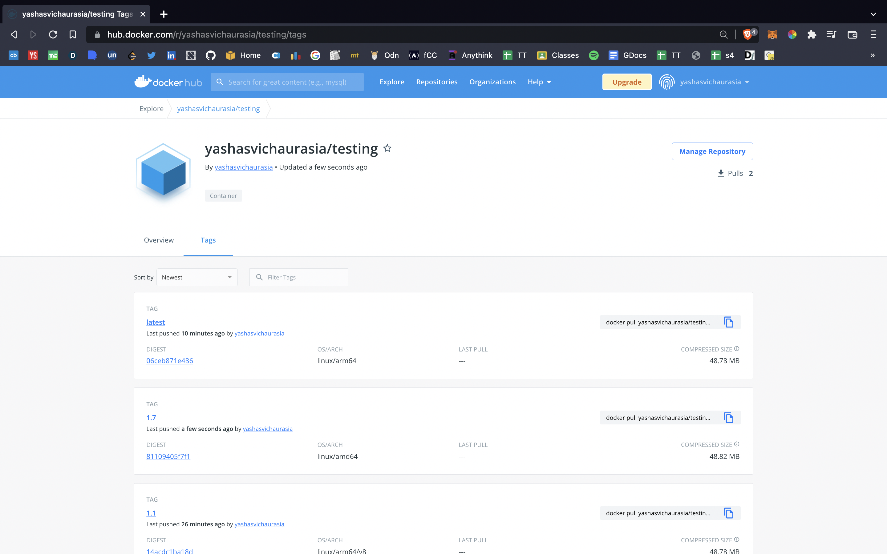
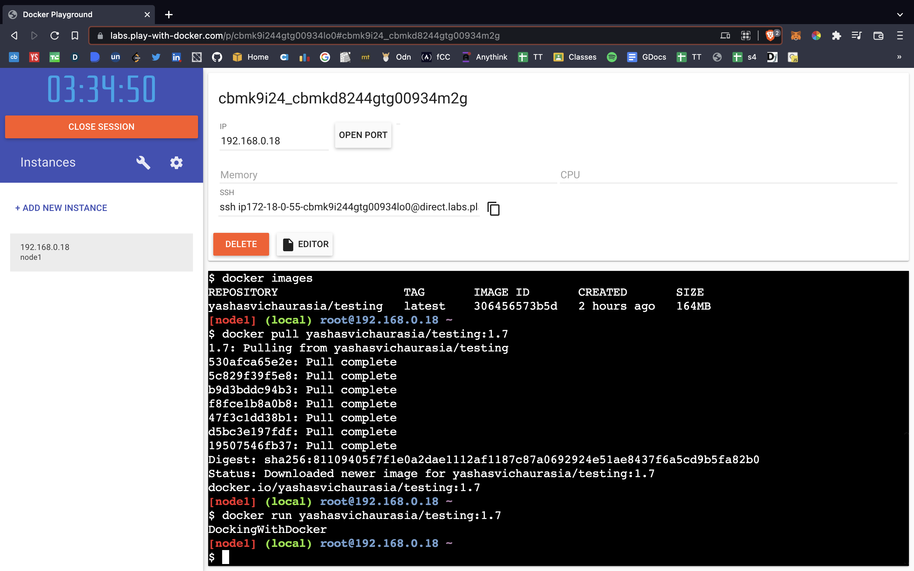

# DockerHub


## Sharing Docker Images
We use DockerHub to share images like we use to share are github repos on github

### Lets go
`docker login`: this would automatically connect your docker desktop to dockerhub if you are signed in credentials on Dockhub.

Then we identify our local repo by its tag so we have the following commands:
```
docker tag local-image:tagname new-repo:tagname
docker push new-repo:tagname
```
*The command on line 2 is used to push the newrepo to DockerHub

In line 1 we could have used name of prexisting repo on github to push the image to.



### Another way
1. Go to DockerHub and create a new repo
1. Use that repo instead 'new-repo' in the above commands
1. Be sure to provide a correct tag

#### Be sure to pull and try running you container on [Play with Docker](https://labs.play-with-docker.com/#) 
Use: `docker pull <docker_repo_name>`


# Errors you might face

## If on Mac M1, you need to build for linux/amd64 
` docker buildx build --platform linux/amd64 -t <tagname> .`  : it builds images for linux 


Otherwise you might get the following error when running container on Linux based systems.

The issue being Mac M1's use arm64  arch while linux systems use amd64
```
WARNING: The requested image's platform (linux/arm64) does not match the detected host platform (linux/amd64) and no specific platform was requested
exec /usr/local/bin/docker-entrypoint.sh: exec format error
```

##  denied: requested access to the resource is denied 
[Stackoverflow](https://stackoverflow.com/questions/41984399/denied-requested-access-to-the-resource-is-denied-docker)

