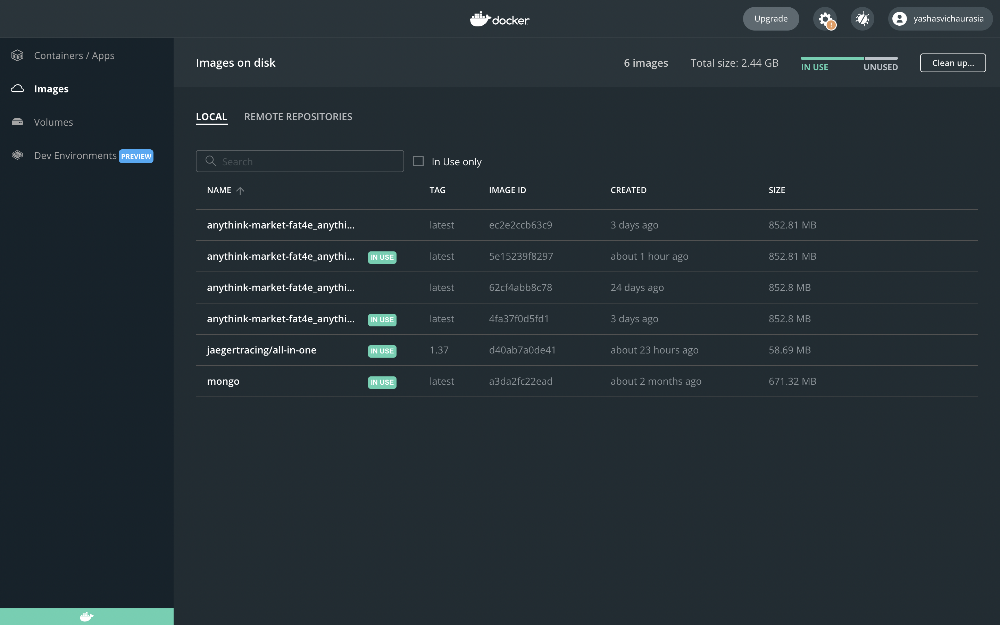
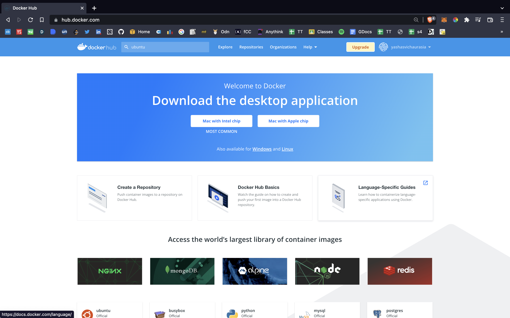

# Docker For All *:whale:*
###### This repository is just a effort to document my understanding of Docker and DockerHub.

<!--  -->

## What is Docker?
Docker is yet another tool used to help you manage your repositories helping them to be quickly setup on other machines without the hassle of setting up the environment to run the code in .

## Best way to learn lets get going:

###  Lets quickly download and setup docker first

Go Ahead and Download Docker for you System : [Docker Website](https://www.docker.com/get-started/)

Also create your free account on DockerHub : [Docker Website](https://www.docker.com/get-started/)

## Docker vs DockerHub
For a quick analogy it is  like Git and GitHub.
Both of them are different but work together.

Basically DockerHub is a platform where we store our Containerized Images on a server just like on github we store our repos 
Below we have DockerDesktop and DockerHub

  

# How to Use this Repo 
1. Follow along folders in order ans they would be nested in each other

1. Each folder will have a seaparate README to explain the contents.

### Some Resources:

- [Quick Guide to Docker](https://www.youtube.com/watch?v=gAkwW2tuIqE)
- [Docker Basics](https://www.youtube.com/watch?v=pTFZFxd4hOI&t=1101s) 

`Thank You`  

